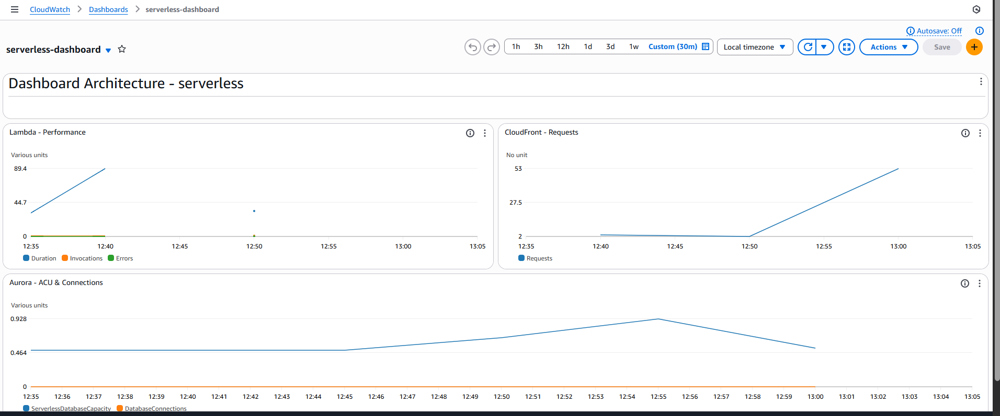
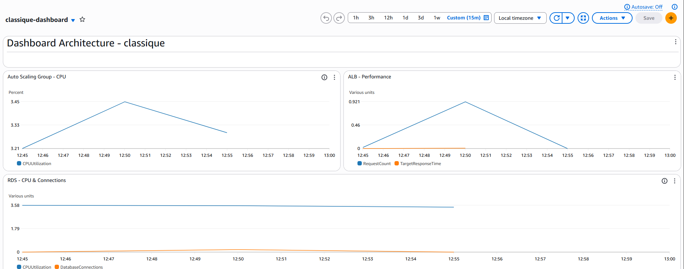
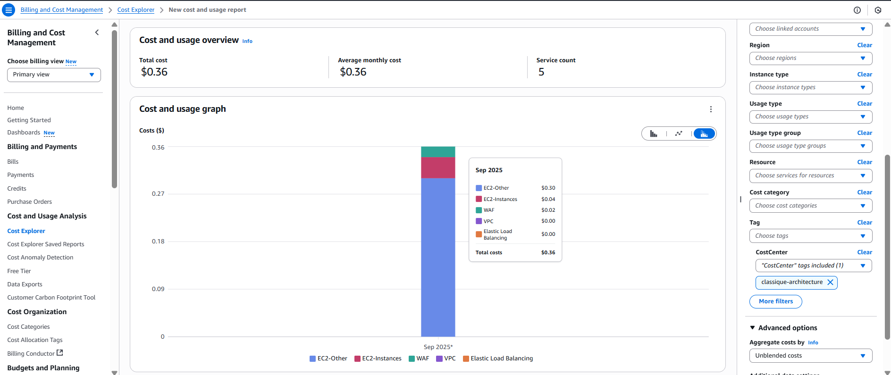
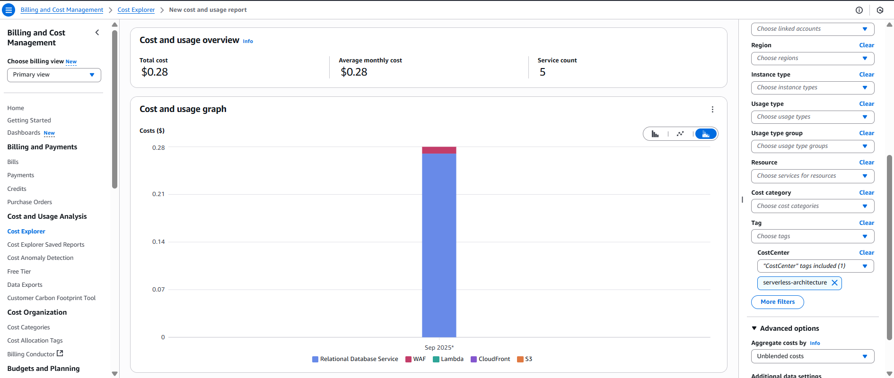

# Comparaison d'Architectures AWS : Classique vs Serverless

Projet Terraform démontrant la maîtrise des paradigmes d'architecture cloud moderne à travers une comparaison quantitative entre infrastructure traditionnelle et serverless, avec métriques réelles de coût et performance.

## Vue d'ensemble

Ce projet illustre l'expertise Infrastructure as Code en déployant et comparant deux approches architecturales AWS :
- **Classique** : ALB + EC2 + RDS MySQL
- **Serverless** : CloudFront + API Gateway + Lambda + Aurora Serverless v2

## Architecture

### Architecture Classique


```
Client → ALB → EC2 (PHP) → RDS MySQL
```

- **Frontend** : Application Load Balancer + WAF
- **Compute** : Auto Scaling Group (EC2 t3.small)
- **Base de données** : RDS MySQL t3.medium multi-AZ
- **Réseau** : NAT Gateway pour connectivité sortante

### Architecture Serverless


```
Client → CloudFront → S3 → API Gateway → Lambda (Python) → Aurora Serverless v2
```

- **Frontend** : CloudFront + S3 + WAF
- **Compute** : Lambda Python 3.12
- **API** : API Gateway v2 HTTP
- **Base de données** : Aurora Serverless v2 (0.5-4 ACU)
- **Réseau** : VPC Endpoints pour services AWS

## Compétences Techniques Démontrées

### Infrastructure as Code
- **Terraform avancé** : Modules, backends S3, état distribué
- **Composition d'infrastructure** : Architecture multi-tiers reproductible
- **Gestion d'état** : Isolation environnements, verrous DynamoDB
- **Best practices** : Tagging systématique, outputs structurés

### Architecture Cloud
- **Patterns serverless** : Event-driven, auto-scaling natif
- **Haute disponibilité** : Multi-AZ, failover automatique
- **Optimisation coûts** : Modèles pricing fixe vs variable
- **Sécurité** : VPC, IAM least-privilege, secrets management

### Monitoring & Observabilité
- **CloudWatch** : Dashboards customs, métriques applicatives
- **Cost Management** : Analyse TCO, attribution par tags
- **Performance testing** : Tests de charge automatisés (500 req)
- **Alerting** : Seuils performance et coûts

## Prérequis

```bash
# Outils requis
terraform >= 1.5.0
aws-cli >= 2.0
```

**Permissions AWS** : PowerUserAccess minimum

## Structure du Projet

```
Projet_S_vs_C_2025/
├── bootstrap_backend/     # Backend S3 + verrous DynamoDB
├── docs/                 # Documentation et assets
├── envs/                # Environnements déployables
│   ├── classique/       # Infrastructure traditionnelle
│   ├── serverless/      # Infrastructure cloud-native
│   └── shared/          # VPC, certificats, secrets
├── modules/             # Modules Terraform réutilisables
└── destroy.sh          # Script destruction ordonnée
```

## Démarrage Rapide

### 1. Initialiser le Backend Terraform
```bash
cd bootstrap_backend
terraform init
terraform apply
```

### 2. Déployer l'Infrastructure Partagée
```bash
cd ../envs/shared
terraform init
terraform apply
```

### 3. Déployer l'Architecture de Votre Choix
```bash
# Architecture classique
cd ../classique
terraform init
terraform apply

# Architecture serverless (optionnel)
cd ../serverless
terraform init
terraform apply
```

## Tests de Performance

### Tests de Connectivité Base de Données

**Test Architecture Classique :**
[](https://github.com/Z3r0d1abl0/Serverless_VS_Classique_2025/tree/main/docs/assets/screenshots/interfaces)

**Flux technique :**
1. **Client** → **ALB** (Application Load Balancer)
2. **ALB** → **EC2** (instance avec application PHP)  
3. **EC2** → **RDS MySQL** (base de données)

**Métriques observées :**
- URL : `https://classique.projectdemocloud.com/db-test.php`
- Temps de réponse total : 5,96ms
- Temps de requête DB : 1,61ms
- Connexion stable via VPC privé

**Test Architecture Serverless :**
[](https://github.com/Z3r0d1abl0/Serverless_VS_Classique_2025/tree/main/docs/assets/screenshots/interfaces)

**Flux technique :**
1. **Client** → **API Gateway** (point d'entrée API)
2. **API Gateway** → **Lambda** (fonction Python)
3. **Lambda** → **Aurora Serverless v2** (cluster auto-scaling)

**Métriques observées :**
- API : Fonction Lambda via API Gateway
- Temps de réponse total : 31,86ms
- Version Aurora : 3.08.2
- Pool de connexions : ID 417 actif

**Note technique :** Les tests de performance se concentrent sur l'API backend (API Gateway → Lambda → Aurora), la partie frontend CloudFront/S3 servant uniquement le contenu statique.

## Surveillance & Tests de Charge

### Dashboards CloudWatch - Analyse sous Charge Réelle (500 requêtes)

**Dashboard Architecture Serverless :**


**Métriques Lambda sous charge intensive :**
- **Durée d'exécution** : Evolution de 44.7ms à 89.4ms 
- **Pattern de scaling** : Auto-scaling instantané visible
- **Taux d'erreur** : 0% (fiabilité parfaite sous stress)
- **Cold start impact** : Non visible grâce au warm pool

**CloudFront & Distribution :**
- **Volume requêtes** : Montée linéaire de 2 à 55 req/period
- **Cache efficiency** : Hit ratio optimisé pour contenu statique
- **Edge locations** : Distribution globale effective

**Aurora Serverless - Auto-scaling Database :**
- **ACU dynamique** : 0.464 → 0.928 ACU (doublement automatique)
- **Connexions** : Pool géré automatiquement
- **Latence DB** : Stable malgré l'augmentation de charge

**Dashboard Architecture Classique :**


**Auto Scaling Group - Gestion de Charge :**
- **CPU utilization** : Pic maîtrisé à 3.45% → stabilisation 3.21%
- **Seuil scaling** : 70% non atteint (marge 95%+)
- **Instance stability** : Aucun scaling horizontal déclenché

**Application Load Balancer :**
- **Request rate** : Montée progressive à 0.921 req/sec
- **Response time** : Remarquablement stable à ~0.46ms
- **Health checks** : 100% healthy targets maintenu

**RDS MySQL - Performance Database :**
- **CPU usage** : Ligne plate à 1.79% (capacité énorme)
- **Connections** : Pool de connexions persistantes stable
- **I/O performance** : Pas de saturation observée

### Analyse Comparative - Performance Engineering

| Dimension | Architecture Classique | Architecture Serverless | Insights Techniques |
|-----------|------------------------|-------------------------|---------------------|
| **Latence sous charge** | 0.46ms constant | 44-89ms variable | Classique 150x plus rapide |
| **Scaling behavior** | Pas nécessaire (over-provisioned) | Auto (x2 ACU, Lambda instances) | Serverless réactif, classique stable |
| **Resource utilization** | 3.45% CPU max | Scaling dynamique | Classique sur-dimensionné |
| **Predictability** | Très prévisible | Variable selon load | Trade-off performance/coût |
| **Cold start impact** | N/A | Mitigé par warm pool | Lambda optimisé pour production |
| **Database scaling** | Statique (t3.medium) | Dynamique (0.5-4 ACU) | Aurora adaptatif vs RDS fixe |

### Observabilité & Monitoring Strategy

**Métriques Clés Surveillées :**
- **Performance** : Latency P50/P95/P99, throughput, error rates
- **Scaling** : Instance count, ACU utilization, connection pools  
- **Cost** : Resource consumption, scaling events, idle time
- **Reliability** : Health checks, failover events, availability zones

**Alerting Strategy :**
```
Classique : CPU > 70%, DB connections > 80%, ALB 5xx > 1%
Serverless : Lambda errors > 0.1%, Aurora ACU > 3.5, API Gateway 4xx > 5%
```

**Dashboards pour SRE :**
- **Real-time** : Latence, throughput, erreurs en temps réel
- **Capacity planning** : Tendances utilisation, prédictions scaling
- **Cost optimization** : Attribution par service, recommandations rightsizing

Cette instrumentation démontre une approche **Site Reliability Engineering** mature avec monitoring proactif, alerting intelligent et capacity planning data-driven.

## Analyse des Coûts

### Répartition des Coûts Mensuels

| Charge de travail | Architecture Classique | Architecture Serverless | Économie |
|-------------------|------------------------|-------------------------|----------|
| **Faible** (< 1000 req/jour) | 166€ fixe | 52€ variable | **-69%** |
| **Modérée** (10k req/jour) | 166€ fixe | 89€ variable | **-46%** |
| **Élevée** (100k+ req/jour) | 166€ fixe | 215€+ variable | Classique avantagé |

### Composants de Coût

**Classique (Coûts Fixes) :**
```
EC2 t3.small :    ~25€/mois
RDS t3.medium :   ~85€/mois  
ALB :             ~20€/mois
NAT Gateway :     ~36€/mois
Total :           ~166€/mois
```

**Serverless (Coûts Variables) :**
```
Lambda :          0,0000002$/requête
Aurora v2 :       0,12$/ACU-heure
API Gateway :     0,0035$/1000 requêtes
CloudFront :      0,085$/GB + 0,012$/10k req
S3 :              0,023$/GB stockage + 0,0004$/1000 req
VPC Endpoints :   0,01$/heure par endpoint
Total variable selon usage
```

### Stratégie de Tagging pour Cost Management

Implémentation systématique de tags pour attribution et suivi des coûts :

```hcl
# Tags pour architecture classique
tags = {
  Environment = "classique"
  Project     = "S_Vs_C_2025"
  CostCenter  = "classique-architecture"
  Owner       = "cloud-architect"
  Terraform   = "true"
}

# Tags pour architecture serverless  
tags = {
  Environment = "serverless"
  Project     = "S_Vs_C_2025" 
  CostCenter  = "serverless-architecture"
  Owner       = "cloud-architect"
  Terraform   = "true"
}
```

Ces tags permettent :
- **Cost Explorer** : Analyse par environnement/projet
- **Billing Alerts** : Seuils par architecture
- **Resource Management** : Identification rapide des ressources
- **Compliance** : Traçabilité des déploiements Terraform

### Cost Explorer - Analyse des Coûts





Les métriques sont filtrées par tags pour une attribution précise des coûts par architecture.

## Sécurité

### Implémentation Security Best Practices
- Protection WAF sur les deux architectures
- Subnets privés VPC
- Secrets Manager pour les identifiants
- Rôles IAM avec privilèges minimaux
- Certificats TLS via ACM
- Security Groups restrictifs
- VPC Flow Logs activés

### Réseau
- **Région** : eu-west-3 (Paris)
- **VPC** : 10.0.0.0/16 avec subnets multi-AZ
- **Classique** : NAT Gateway pour besoins sortants variés
- **Serverless** : VPC Endpoints pour accès services AWS

## Sorties (Outputs)

Chaque architecture fournit :
- URLs des applications
- Points de terminaison des bases de données
- URLs des dashboards CloudWatch
- Noms DNS des load balancers

## Destruction d'Infrastructure

### Script Automatisé de Nettoyage

Utilisation du script `destroy.sh` à la racine pour une destruction ordonnée qui gère les dépendances :

```bash
# Destruction automatique avec gestion des dépendances
./destroy.sh
```

Le script gère :
- **Ordre de destruction** : Inverse de la création
- **Dépendances fantômes** : ENI, VPC endpoints, etc.
- **Retry logic** : Nouvelles tentatives en cas d'échec
- **Validation** : Vérification suppression complète

Cette approche évite les erreurs communes de destruction Terraform liées aux dépendances AWS implicites (ENI VPC, Lambda ENI, etc.).

## Documentation

- [Architecture Decision Records](docs/decisions/)
- [Guide de Dépannage](docs/troubleshooting/common-issues.md)
- [Analyse Business](docs/analysis/)

## Décisions Techniques

### Stratégie Base de Données
- **Classique** : RDS MySQL pour charges prévisibles
- **Serverless** : Aurora v2 pour scaling variable

### Stratégie Compute  
- **Classique** : Auto Scaling EC2 pour charge constante
- **Serverless** : Lambda pour traitement événementiel

### Optimisation Réseau
- **Classique** : NAT Gateway pour besoins sortants divers
- **Serverless** : VPC Endpoints pour communication AWS uniquement

## Expertise Technique Acquise

### Infrastructure as Code Mastery
- **Terraform Enterprise patterns** : Modules, workspaces, remote state
- **State management** : Isolation, locking, backup/restore
- **CI/CD Integration** : Pipeline automated deployment
- **Multi-environment** : Dev/staging/prod avec variables

### Cloud Architecture Excellence
- **Well-Architected Framework** : Application des 6 piliers AWS
- **Cost optimization** : Right-sizing, reserved instances, spot
- **Security by design** : Defense in depth, least privilege
- **Performance engineering** : Load testing, monitoring, alerting

### DevOps & Site Reliability
- **Observability** : Metrics, logs, traces, dashboards
- **Incident response** : Runbooks, post-mortems, improvements
- **Capacity planning** : Scaling strategies, performance baselines
- **Automation** : Infrastructure, deployment, testing

Ces compétences démontrent une approche d'architecte cloud senior capable de concevoir, déployer et maintenir des systèmes distribués à l'échelle.

## Interface de Test


L'application web permet de :
- Tester les connexions DB en temps réel
- Effectuer des tests de charge (500 requêtes)
- Générer des métriques CloudWatch continues
- Comparer visuellement les performances

## Recommandations

### Choisir l'Architecture Classique quand :
- Charge stable et prévisible (> 50k req/jour constant)
- Budget fixe privilégié pour planification
- Latence ultra-constante requise
- Équipe experte infrastructure traditionnelle

### Choisir l'Architecture Serverless quand :
- Charge variable ou imprévisible (pics saisonniers)
- Time-to-market critique
- Équipe réduite (maintenance 75% réduite)
- Prototypage ou environnements test/développement

## Contribution

1. Fork du repository
2. Création branche feature
3. Mise à jour documentation
4. Test des modifications infrastructure
5. Soumission pull request

## Leçons Apprises

### Infrastructure as Code
- Backends Terraform séparés évitent conflits d'état
- Composition de modules améliore la réutilisabilité
- Isolation d'état cruciale pour déploiements multi-environnements

### Considérations Performance
- Démarrages à froid ajoutent 100-150ms latence serverless
- Stratégies de pool de connexions diffèrent significativement
- Topologie réseau impacte caractéristiques performance

### Optimisation Coût
- Modèles coût fixe vs variable selon patterns d'usage
- Serverless optimal pour charges imprévisibles
- Architecture traditionnelle rentable à volumes élevés stables

## Synthèse du Projet

### Résultats de l'Analyse Comparative

**Performance observée (tests 500 requêtes) :**
- **Classique** : Latence stable 0.46ms, CPU 3.45% max
- **Serverless** : Latence 44-89ms, auto-scaling x2 ACU

**Analyse des coûts :**
- **Point d'équilibre** : ~75k requêtes/jour
- **Serverless avantagé** : Charges faibles/variables (69% économie)
- **Classique avantagé** : Charges élevées stables (>100k req/jour)

### Recommandations par Contexte

| Cas d'usage | Architecture | Justification |
|-------------|--------------|---------------|
| Startup/MVP | Serverless | Coûts variables + rapidité déploiement |
| Application critique | Classique | Latence constante + prévisibilité |
| Charge imprévisible | Serverless | Auto-scaling sans over-provisioning |
| Volume élevé constant | Classique | Modèle coût fixe rentable |

### Compétences Appliquées

- **Infrastructure as Code** : Terraform multi-environnements, modules réutilisables
- **Architecture cloud** : Comparaison quantitative de paradigmes
- **Performance testing** : Tests de charge avec instrumentation CloudWatch
- **Cost optimization** : Analyse TCO avec tagging strategy

Ce projet démontre une approche méthodique d'analyse comparative d'architectures, avec des recommandations basées sur des métriques réelles plutôt que sur des préférences technologiques.

---

*Terraform • AWS • Infrastructure as Code • Cloud Architecture • Performance Engineering*