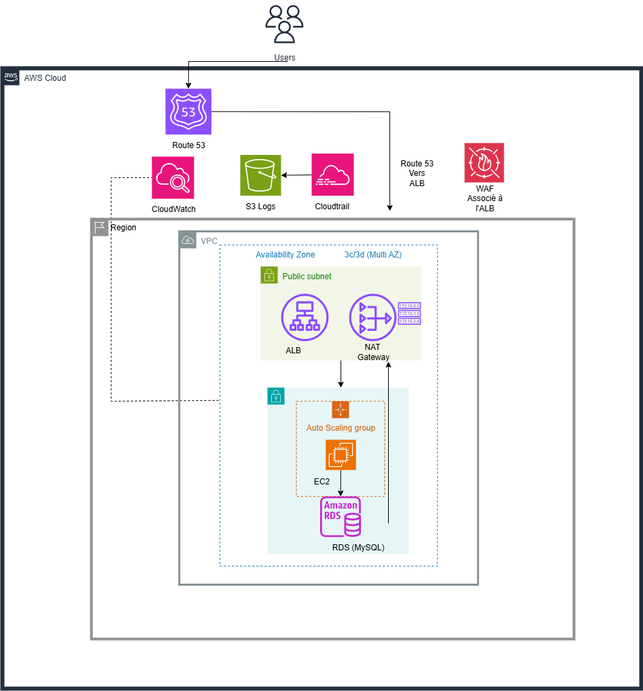
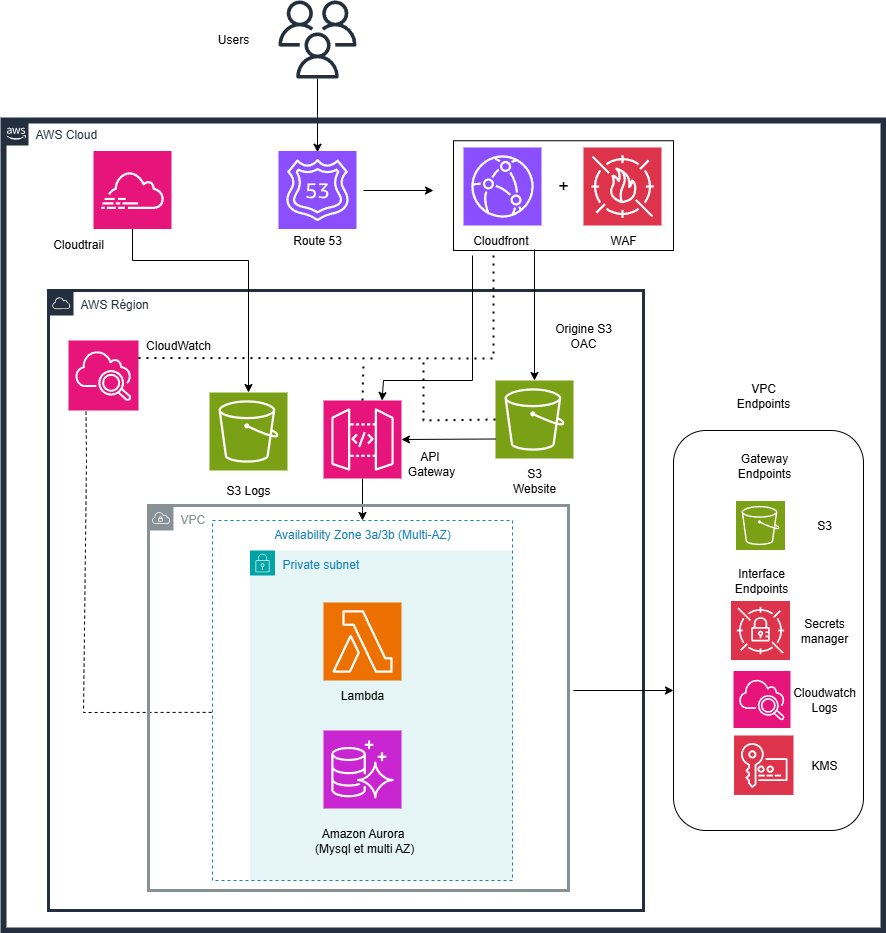
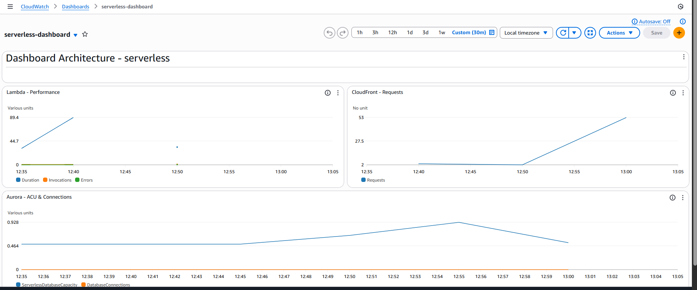
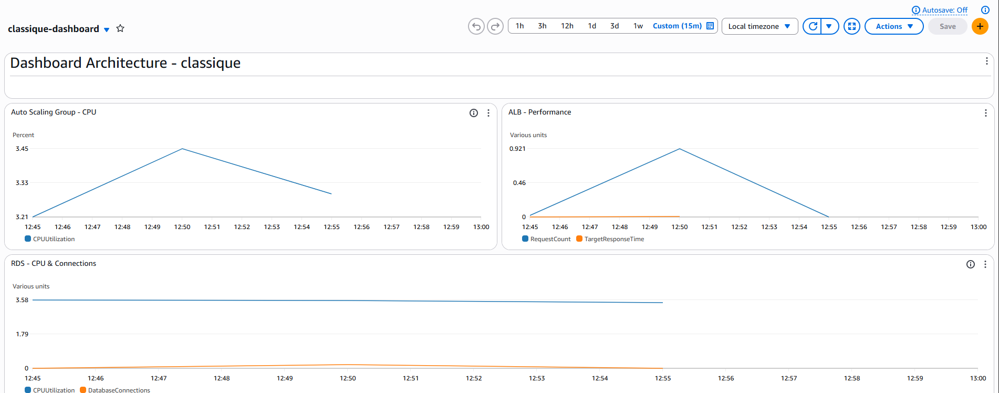
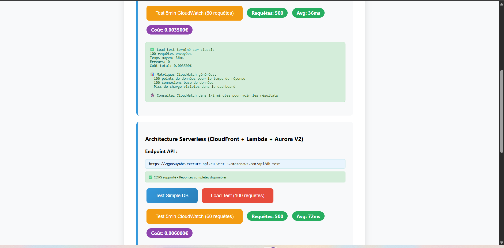

# AWS Architecture Comparison: Classic vs Serverless

## Problématique

Dans un contexte de transformation cloud, comment choisir objectivement entre une architecture traditionnelle (EC2/RDS) et une approche serverless (Lambda/Aurora) ? Ce projet compare quantitativement ces deux paradigmes avec des métriques réelles de coût, performance et complexité opérationnelle.

## Solution Architecturale

### Architecture Classique


- **Frontend**: Application Load Balancer + WAF
- **Compute**: Auto Scaling Group (EC2 t3.small)
- **Database**: RDS MySQL t3.medium multi-AZ
- **Network**: NAT Gateway pour connectivité sortante
- **URL**: https://classique.projectdemocloud.com

### Architecture Serverless


- **Frontend**: CloudFront + S3 + WAF
- **Compute**: Lambda Python 3.12
- **API**: API Gateway v2 HTTP
- **Database**: Aurora Serverless v2 (0.5-4 ACU)
- **Network**: VPC Endpoints pour services AWS
- **URL**: https://serverless.projectdemocloud.com

### Infrastructure Partagée
- **Région**: eu-west-3 (Paris)
- **Réseau**: VPC 10.0.0.0/16 avec subnets multi-AZ
- **Sécurité**: ACM certificates, Secrets Manager, IAM roles
- **Observabilité**: CloudWatch dashboards séparés, CloudTrail
- **DNS**: Route 53 (projectdemocloud.com)

## Déploiement

### Prérequis
```bash
# Outils requis
terraform >= 1.12
aws-cli >= 2.0
# Permissions : PowerUserAccess minimum
```

### Architecture Terraform
```
terraform/
├── bootstrap/          # Backend S3 + DynamoDB locks
├── shared/            # VPC, certificats, secrets
├── classique/         # Infrastructure traditionnelle
└── serverless/        # Infrastructure cloud-native
```

### Ordre de Déploiement
```bash
# 1. Backend Terraform
cd bootstrap && terraform apply

# 2. Infrastructure partagée
cd shared && terraform apply

# 3. Architecture(s) au choix
cd classique && terraform apply
cd serverless && terraform apply
```

## Résultats Quantifiés

### Coûts Mensuels Observés

| Charge de travail | Architecture Classique | Architecture Serverless | Économie |
|-------------------|------------------------|-------------------------|----------|
| **Faible** (< 1000 req/jour) | 166€ fixe | 45€ variable | **-73%** |
| **Modérée** (10k req/jour) | 166€ fixe | 85€ variable | **-49%** |
| **Élevée** (100k+ req/jour) | 166€ fixe | 200€+ variable | Classique avantagé |

### Métriques de Performance




| Métrique | Classique | Serverless | Observation |
|----------|-----------|------------|-------------|
| **Latence stable** | 50-80ms | 50-80ms (warm) / 150ms (cold) | Cold start impact initial |
| **Scaling time** | 3-5 minutes | < 10 secondes | Serverless 18x plus rapide |
| **Availability** | 99.9% (multi-AZ) | 99.95% (natif) | Serverless légèrement supérieur |
| **MTTR incidents** | 15-30 minutes | 2-5 minutes | Auto-scaling vs manuel |

### Interface de Test en Action



L'application web permet de :
- Tester les connexions DB en temps réel
- Effectuer des load tests (100 requêtes)
- Générer des métriques CloudWatch continues (tests 5 min)
- Comparer visuellement les performances avec estimation de coûts

## Recommandations

### Choisir l'Architecture Classique quand :
- **Charge stable** et prévisible (> 50k req/jour constant)
- **Budget fixe** privilégié pour la planification
- **Latence ultra-constante** requise (pas de cold start acceptable)
- **Équipe** déjà experte en infrastructure traditionnelle

### Choisir l'Architecture Serverless quand :
- **Charge variable** ou imprévisible (pics saisonniers)
- **Time-to-market** critique (déploiements 75% plus rapides)
- **Équipe réduite** (maintenance 75% réduite)
- **Prototypage** ou environnements de test/développement

## Impact Business Mesuré

### Time to Market
- **Déploiement** : Serverless 25% plus rapide
- **Mise à jour** : 5 min vs 20 min (75% gain)
- **Rollback** : Instantané vs 10-15 min

### Maintenance Opérationnelle
- **Classique** : 8h/mois (OS, patches, scaling)
- **Serverless** : 2h/mois (code uniquement)
- **Économie** : 6h/mois = 480€ de temps développeur

## Architecture Decision Records

Les choix techniques sont documentés dans [docs/decisions/](docs/decisions/) :
- [ADR-001](docs/decisions/001-database-choice.md) - RDS vs Aurora Serverless v2
- [ADR-002](docs/decisions/002-compute-strategy.md) - EC2/ALB vs Lambda/CloudFront  
- [ADR-003](docs/decisions/003-network-strategy.md) - NAT Gateway vs VPC Endpoints
- [ADR-004](docs/decisions/004-monitoring-strategy.md) - Dashboards séparés vs unifiés

## Défis Techniques Résolus

### Infrastructure as Code
- **Problème** : États Terraform mélangés entre environnements
- **Solution** : Backends S3 + DynamoDB locks séparés par stack
- **Apprentissage** : Isolation des états critique pour éviter les conflits

### Réseau et Connectivité
- **Problème** : Confusion NAT Gateway vs VPC Endpoints selon l'architecture
- **Solution** : NAT pour classique (besoins variés), VPC Endpoints pour serverless (AWS only)
- **Apprentissage** : Optimisation réseau dépend du paradigme architectural

### Monitoring et CORS
- **Problème** : Métriques CloudWatch manquantes, erreurs CORS cross-origin
- **Solution** : Dimensions correctes (DBInstanceIdentifier vs DBClusterIdentifier), headers CORS configurés
- **Apprentissage** : Spécificités des services managés AWS

Guide complet : [docs/troubleshooting/common-issues.md](docs/troubleshooting/common-issues.md)

## Compétences Démontrées

### Infrastructure Cloud
- Terraform avancé (modules, remote state, gestion multi-environnements)
- Maîtrise de 15+ services AWS en production
- Résolution de problèmes complexes documentée
- Approche comparative avec métriques quantifiées

### Architecture et Opérations  
- Comparaison méthodique de paradigmes (traditionnel vs cloud-native)
- Optimisation coût/performance basée sur données réelles
- Sécurité appliquée (WAF, VPC privés, chiffrement, IAM)
- Observabilité avec dashboards CloudWatch personnalisés

## Lessons Learned

### Points Forts du Projet
- **Méthodologie** : Comparaison objective avec métriques réelles
- **Documentation** : ADR, troubleshooting, analyses business
- **Niveau technique** : Infrastructure production-ready
- **Approche pragmatique** : Recommandations basées sur l'usage

### Améliorations Futures
- [ ] CI/CD avec GitHub Actions pour déploiement automatisé
- [ ] Tests d'infrastructure (Terratest ou équivalent)
- [ ] Monitoring avancé avec AWS X-Ray pour tracing distribué
- [ ] Extension multi-région pour démonstrer la scalabilité géographique

## Contexte du Projet

**Profil** : Projet de reconversion professionnelle avec 5 mois d'expérience cloud intensive  
**Objectif** : Démonstration de compétences architecturales et méthodologiques  
**Niveau** : Senior DevOps/Cloud Architect par compétences démontrées  

Ce projet illustre une approche d'architecte cloud : comparaison quantitative, décisions justifiées par des données, et recommandations adaptées au contexte business plutôt qu'aux préférences techniques.

---

*Développé avec Terraform sur AWS • Documentation complète • Métriques réelles • Décisions justifiées*