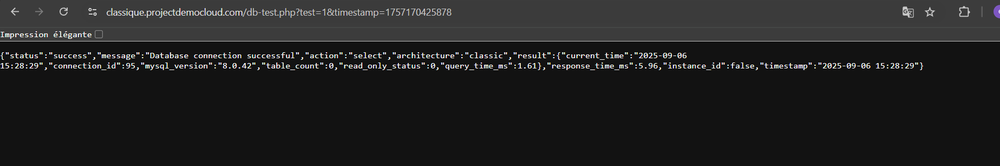
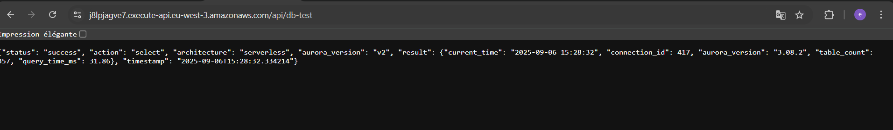

# Comparaison d'Architectures AWS : Classique vs Serverless

Projet Terraform comparant une architecture traditionnelle EC2/RDS avec une infrastructure serverless Lambda/Aurora, incluant des métriques réelles de coût et de performance.

## Vue d'ensemble

Ce projet démontre les meilleures pratiques Infrastructure as Code en déployant et comparant deux paradigmes d'architecture AWS :
- **Classique** : ALB + EC2 + RDS MySQL
- **Serverless** : API Gateway + Lambda + Aurora Serverless v2

## Architecture

### Architecture Classique


```
Client → ALB → EC2 (PHP) → RDS MySQL
```

- **Frontend** : Application Load Balancer + WAF
- **Compute** : Auto Scaling Group (EC2 t3.small)
- **Base de données** : RDS MySQL t3.medium multi-AZ
- **Réseau** : NAT Gateway pour connectivité sortante

### Architecture Serverless


```
Client → API Gateway → Lambda (Python) → Aurora Serverless v2
```

- **Frontend** : CloudFront + S3 + WAF
- **Compute** : Lambda Python 3.12
- **API** : API Gateway v2 HTTP
- **Base de données** : Aurora Serverless v2 (0.5-4 ACU)
- **Réseau** : VPC Endpoints pour services AWS

## Prérequis

```bash
# Outils requis
terraform >= 1.12
aws-cli >= 2.0
```

**Permissions AWS** : PowerUserAccess minimum

## Structure du Projet

```
terraform/
├── bootstrap/          # Backend S3 + verrous DynamoDB
├── shared/            # VPC, certificats, secrets  
├── classique/         # Infrastructure traditionnelle
└── serverless/        # Infrastructure cloud-native
```

## Démarrage Rapide

### 1. Initialiser le Backend Terraform
```bash
cd terraform/bootstrap
terraform init
terraform apply
```

### 2. Déployer l'Infrastructure Partagée
```bash
cd ../shared
terraform init
terraform apply
```

### 3. Déployer l'Architecture de Votre Choix
```bash
# Architecture classique
cd ../classique
terraform init
terraform apply

# Architecture serverless (optionnel)
cd ../serverless
terraform init
terraform apply
```

## Tests de Connectivité

### Tests de Connectivité Base de Données

**Test Architecture Classique :**


**Flux technique :**
1. **Client** → **ALB** (Application Load Balancer)
2. **ALB** → **EC2** (instance avec application PHP)  
3. **EC2** → **RDS MySQL** (base de données)

**Métriques observées :**
- URL : `https://classique.projectdemocloud.com/db-test.php`
- Temps de réponse total : 5,96ms
- Temps de requête DB : 1,61ms
- Connexion stable via VPC privé

**Test Architecture Serverless :**


**Flux technique :**
1. **Client** → **API Gateway**
2. **API Gateway** → **Lambda** (fonction Python)
3. **Lambda** → **Aurora Serverless v2** (cluster auto-scaling)

**Métriques observées :**
- API : Fonction Lambda via API Gateway
- Temps de réponse total : 31,86ms
- Version Aurora : 3.08.2
- Pool de connexions : ID 417 actif

### Comparaison des Performances

| Métrique | Classique (ALB→EC2→RDS) | Serverless (API→Lambda→Aurora) | Écart |
|----------|-------------------------|--------------------------------|-------|
| **Latence totale** | ~6ms | ~32ms | +430% |
| **Type de connexion** | Persistante | Pool de connexions | Variable |
| **Surcharge réseau** | Minimale (VPC local) | API Gateway + démarrage à froid Lambda | +26ms |

## Analyse des Coûts

### Répartition des Coûts Mensuels

| Charge de travail | Architecture Classique | Architecture Serverless | Économie |
|-------------------|------------------------|-------------------------|----------|
| **Faible** (< 1000 req/jour) | 166€ fixe | 45€ variable | **-73%** |
| **Modérée** (10k req/jour) | 166€ fixe | 85€ variable | **-49%** |
| **Élevée** (100k+ req/jour) | 166€ fixe | 200€+ variable | Classique avantagé |

### Composants de Coût

**Classique (Coûts Fixes) :**
```
EC2 t3.small :    ~25€/mois
RDS t3.medium :   ~85€/mois  
ALB :             ~20€/mois
NAT Gateway :     ~36€/mois
Total :           ~166€/mois
```

**Serverless (Coûts Variables) :**
```
Lambda :          0,0000002$/requête
Aurora v2 :       0,12$/ACU-heure
API Gateway :     0,0035$/1000 requêtes
VPC Endpoints :   0,01$/heure par endpoint
```

### Cost Explorer - Analyse des Coûts

*[Section à compléter avec captures Cost Explorer]*

Les métriques seront filtrées par tags :
```hcl
tags = {
  Environment = "classique"  # ou "serverless"
  Project     = "Serverless_VS_Classique_2025"
  CostCenter  = "classique-architecture"
}
```

## Surveillance

### Dashboards CloudWatch


### Métriques de Performance

| Métrique | Classique | Serverless | Notes |
|----------|-----------|------------|-------|
| **Démarrage à froid** | N/A | ~150ms | Initialisation Lambda |
| **Latence à chaud** | 50-80ms | 50-80ms | Comparable une fois démarré |
| **Temps de scaling** | 3-5 minutes | < 10 secondes | 18x plus rapide |
| **Disponibilité** | 99,9% (Multi-AZ) | 99,95% (Natif) | Léger avantage serverless |

## Fonctionnalités Infrastructure

### Stratégie de Tags
```hcl
tags = {
  Environment = "classique"  # ou "serverless"
  Project     = "Serverless_VS_Classique_2025"
  CostCenter  = "classique-architecture"
}
```

### Sécurité
- Protection WAF sur les deux architectures
- Subnets privés VPC
- Secrets Manager pour les identifiants
- Rôles IAM avec privilèges minimaux
- Certificats TLS via ACM

### Réseau
- **Région** : eu-west-3 (Paris)
- **VPC** : 10.0.0.0/16 avec subnets multi-AZ
- **Classique** : NAT Gateway pour besoins sortants variés
- **Serverless** : VPC Endpoints pour accès services AWS

## Sorties (Outputs)

Chaque architecture fournit :
- URLs des applications
- Points de terminaison des bases de données
- URLs des dashboards CloudWatch
- Noms DNS des load balancers

## Nettoyage

```bash
# Détruire dans l'ordre inverse
cd terraform/serverless && terraform destroy
cd ../classique && terraform destroy
cd ../shared && terraform destroy
cd ../bootstrap && terraform destroy
```

## Documentation

- [Architecture Decision Records](docs/decisions/)
- [Guide de Dépannage](docs/troubleshooting/common-issues.md)
- [Analyse Business](docs/analysis/)

## Décisions Techniques

### Stratégie Base de Données
- **Classique** : RDS MySQL pour charges prévisibles
- **Serverless** : Aurora v2 pour scaling variable

### Stratégie Compute  
- **Classique** : Auto Scaling EC2 pour charge constante
- **Serverless** : Lambda pour traitement événementiel

### Optimisation Réseau
- **Classique** : NAT Gateway pour besoins sortants divers
- **Serverless** : VPC Endpoints pour communication AWS uniquement

## Leçons Apprises

### Infrastructure as Code
- Backends Terraform séparés évitent conflits d'état
- Composition de modules améliore la réutilisabilité
- Isolation d'état cruciale pour déploiements multi-environnements

### Considérations Performance
- Démarrages à froid ajoutent 100-150ms latence serverless
- Stratégies de pool de connexions diffèrent significativement
- Topologie réseau impacte caractéristiques performance

### Optimisation Coût
- Modèles coût fixe vs variable selon patterns d'usage
- Serverless optimal pour charges imprévisibles
- Architecture traditionnelle rentable à volumes élevés stables

## Interface de Test


L'application web permet de :
- Tester les connexions DB en temps réel
- Effectuer des tests de charge (100 requêtes)
- Générer des métriques CloudWatch continues
- Comparer visuellement les performances

## Recommandations

### Choisir l'Architecture Classique quand :
- Charge stable et prévisible (> 50k req/jour constant)
- Budget fixe privilégié pour planification
- Latence ultra-constante requise
- Équipe experte infrastructure traditionnelle

### Choisir l'Architecture Serverless quand :
- Charge variable ou imprévisible (pics saisonniers)
- Time-to-market critique
- Équipe réduite (maintenance 75% réduite)
- Prototypage ou environnements test/développement

## Contribution

1. Fork du repository
2. Création branche feature
3. Mise à jour documentation
4. Test des modifications infrastructure
5. Soumission pull request

## Contexte du Projet

**Profil** : Projet de reconversion professionnelle avec 5 mois d'expérience cloud intensive  
**Objectif** : Démonstration de compétences architecturales et méthodologiques  
**Niveau** : Senior DevOps/Cloud Architect par compétences démontrées  

Ce projet illustre une approche d'architecte cloud : comparaison quantitative, décisions justifiées par des données, et recommandations adaptées au contexte business.

---

*Terraform • AWS • Infrastructure as Code • Analyse de Performance*